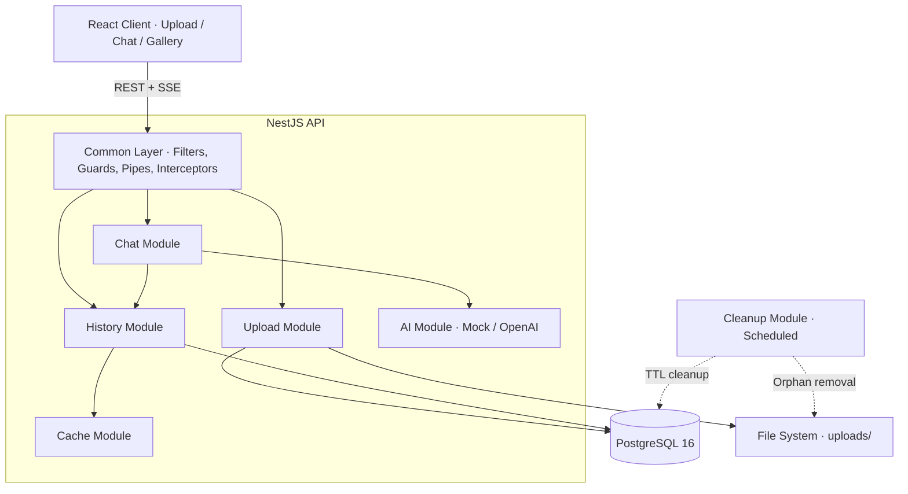

<p align="center">
  
</p>

<h3 align="center">AI-Powered Visual Assistant</h3>

<p align="center">
  Upload an image. Get intelligent analysis. Chat about what you see.
</p>

<p align="center">
  
  
  
  
  
  
  
</p>

---

<p align="center">
  
</p>

---

## Prerequisites

- [Docker](https://docs.docker.com/get-docker/) and [Docker Compose](https://docs.docker.com/compose/install/) (included with Docker Desktop)
- [Node.js 20+](https://nodejs.org/) (only needed for local development)

## Quick Start

```bash
git clone https://github.com/armandojimenez/inksight
cd inksight
cp .env.example .env             # Default values work out of the box
docker compose up --build -d --wait
open http://localhost:3000
```

Docker handles PostgreSQL, the NestJS API, and the React client. The `--wait` flag blocks until both services pass their health checks. All configuration lives in `.env` (see [`.env.example`](.env.example) for all available variables and descriptions).

For local development:

```bash
cp .env.example .env             # Default values work out of the box
docker compose up -d db          # Start PostgreSQL only
npm install                      # Install all dependencies (server + client)
npm run start:dev                # Start NestJS in watch mode (API on :3000)
cd client && npm run dev         # Start Vite dev server (UI on :5173)
```

---

## What Inksight Does

Inksight gives users a single place to drop in an image and talk about it. The assistant analyzes the image on upload, then supports multi-turn conversation with full context retention. Responses stream token-by-token so the interface feels responsive from the first character.

The backend is a modular NestJS monolith that handles image processing, AI orchestration, conversation persistence, and scheduled cleanup. The frontend is a React SPA with real-time SSE streaming, optimistic updates, and a design system aligned to [Inkit's visual language](docs/ui-design-spec.md).

The AI service runs behind a dependency injection token (`AI_SERVICE_TOKEN`). The current implementation is a mock that generates realistic OpenAI-compatible responses. Swapping in a real OpenAI client requires changing one module binding, zero code changes.

---

## Architecture



**Modular monolith.** Each feature lives in its own NestJS module with explicit boundaries. Modules communicate through dependency injection, and every cross-cutting concern (error formatting, request correlation, rate limiting, logging) is handled by global infrastructure in `common/`.

| Module | Purpose |
|--------|---------|
| `upload/` | Image upload, file validation (magic bytes + extension + size), disk storage, gallery listing, file serving, deletion with cascade |
| `chat/` | Chat orchestration (non-streaming + SSE streaming), conversation context assembly, concurrent SSE limiting |
| `ai/` | AI service abstraction via DI token, mock implementation with OpenAI-compatible response format |
| `history/` | Conversation persistence, paginated retrieval, 50-message cap per image |
| `cache/` | In-memory caching layer for database reads, automatic invalidation on writes |
| `cleanup/` | Scheduled data cleanup (24hr TTL), active session protection, orphaned file removal |
| `common/` | Global exception filter, validation pipe, logging interceptor, rate limiting guard, UUID validation, request correlation IDs |
| `health/` | Health check endpoint with active database connectivity verification |

---

## Tech Stack

| Layer | Technology | Why |
|-------|-----------|-----|
| **Language** | TypeScript 5.x | Shared language across backend and frontend, strong typing for API contracts ([ADR-000](docs/adr/000-language-and-platform.md)) |
| **Backend** | NestJS 11 | Module system, built-in DI, pipes/guards/interceptors, Swagger generation ([ADR-001](docs/adr/001-backend-framework.md)) |
| **Database** | PostgreSQL 16 + TypeORM | MVCC for concurrent writes, Data Mapper pattern, migration support ([ADR-002](docs/adr/002-database.md)) |
| **Frontend** | React 18 + Vite | Component model, fast HMR, mature ecosystem ([ADR-003](docs/adr/003-frontend-framework.md)) |
| **Styling** | Tailwind CSS + shadcn/ui | Utility-first with accessible component primitives ([ADR-004](docs/adr/004-styling.md)) |
| **Streaming** | Server-Sent Events (SSE) | POST-compatible, no connection upgrade, simpler proxy config than WebSockets ([ADR-006](docs/adr/006-sse-streaming.md)) |
| **Caching** | In-memory (Redis-ready) | Zero-config for single instance, abstraction supports Redis swap ([ADR-007](docs/adr/007-caching-strategy.md)) |
| **Testing** | Jest + Supertest + Vitest | Layered test pyramid: unit, integration, E2E, contract, client ([ADR-009](docs/adr/009-testing.md)) |
| **Infrastructure** | Docker Compose | Single-command setup, PostgreSQL health checks, multi-stage build |

---

## API Reference

All endpoints are prefixed with `/api`. Interactive documentation is available at [`/api/docs`](http://localhost:3000/api/docs) (Swagger UI). A [Postman collection](postman/inksight.postman_collection.json) is included for interactive testing (import and run, no extra setup needed).

| Method | Endpoint | Description |
|--------|----------|-------------|
| `POST` | `/api/upload` | Upload an image (multipart/form-data, max 16 MB, PNG/JPG/GIF) |
| `GET` | `/api/images` | List uploaded images with message counts (paginated) |
| `GET` | `/api/images/:imageId/file` | Serve the original image file |
| `DELETE` | `/api/images/:imageId` | Delete image + messages + file (cascade) |
| `POST` | `/api/chat/:imageId` | Send a message, get complete AI response (OpenAI format) |
| `POST` | `/api/chat-stream/:imageId` | Send a message, get SSE-streamed AI response |
| `GET` | `/api/chat/:imageId/history` | Get conversation history (paginated, ascending) |
| `GET` | `/api/health` | Health check with database connectivity status |

```bash
# Upload an image
curl -X POST http://localhost:3000/api/upload -F "image=@photo.jpg"

# Chat about it
curl -X POST http://localhost:3000/api/chat/<imageId> \
  -H "Content-Type: application/json" \
  -d '{"message": "What do you see in this image?"}'

# Stream a response
curl -N -X POST http://localhost:3000/api/chat-stream/<imageId> \
  -H "Content-Type: application/json" \
  -d '{"message": "Describe the colors"}'
```

```bash
./scripts/test-api.sh    # Automated full API flow test
```

---

## Project Structure

```
inksight/
├── src/                          # Backend (NestJS)
│   ├── ai/                       #   AI service interface + mock implementation
│   ├── cache/                    #   In-memory caching layer
│   ├── chat/                     #   Chat + SSE streaming controllers
│   ├── cleanup/                  #   Scheduled data cleanup service
│   ├── common/                   #   Cross-cutting infrastructure
│   │   ├── dto/                  #     Shared DTOs (pagination)
│   │   ├── filters/              #     Global exception filter
│   │   ├── guards/               #     Rate limiting, SSE concurrency
│   │   ├── interceptors/         #     Logging, Multer error handling
│   │   ├── pipes/                #     File validation, UUID validation
│   │   ├── swagger/              #     Shared Swagger schemas
│   │   ├── utils/                #     Error response builder, retry
│   │   └── validators/           #     Custom class-validator decorators
│   ├── database/                 #   TypeORM configuration
│   ├── health/                   #   Health check endpoint
│   ├── history/                  #   Conversation persistence
│   ├── upload/                   #   Image upload, gallery, file serving
│   ├── app.module.ts             #   Root module
│   └── main.ts                   #   Bootstrap
│
├── client/                       # Frontend (React + Vite)
│   ├── src/
│   │   ├── components/           #   UI components
│   │   ├── hooks/                #   SSE streaming hook with retry
│   │   ├── lib/                  #   API client, utilities
│   │   ├── styles/               #   Design token system
│   │   └── __tests__/            #   Component, hook, and contract tests
│   └── tailwind.config.ts        #   Tailwind config (mirrors tokens)
│
├── test/                         # Backend tests
│   ├── unit/                     #   25 unit test files
│   ├── integration/              #   14 integration test files
│   ├── e2e/                      #   1 E2E test file (15 scenarios)
│   └── schemas/                  #   2 JSON Schema validation files
│
├── docs/                         # Documentation
│   ├── PRD.md                    #   Product Requirements Document
│   ├── technical-design.md       #   Technical Design Document
│   ├── implementation-plan.md    #   13-phase build plan with TDD gates
│   ├── ui-design-spec.md         #   Component-level UI specification
│   ├── design-system.html        #   Interactive design token reference
│   ├── ai-tools.md               #   AI tools and orchestration disclosure
│   └── adr/                      #   11 Architecture Decision Records
│
├── postman/
│   └── inksight.postman_collection.json  # Postman collection (import and run)
│
├── docker-compose.yml            # PostgreSQL + app (one command)
├── Dockerfile                    # Multi-stage build
└── .env.example                  # All configurable environment variables
```

---

## Testing

**54 test files, 738 tests, 98.7% statement coverage** across six layers: unit, integration, E2E, client, contract, and schema validation.

```bash
npm test                  # Backend unit + integration
npm run test:e2e          # E2E (requires running PostgreSQL)
npm run test:cov          # Coverage report
cd client && npm test     # Client tests (Vitest + RTL)
./scripts/test-api.sh     # Full API smoke test (requires running server)
```

---

## Security

Built in and active by default:

- Rate limiting on all endpoints (configurable per-route via `@Throttle()`)
- Helmet security headers (CSP, HSTS, X-Frame-Options, etc.)
- CORS with configurable allowed origin
- File validation at three levels: extension whitelist, MIME type check, magic byte verification
- Input sanitization via class-validator with global `ValidationPipe` (whitelist mode)
- Request correlation via `X-Request-Id` headers on every response
- Structured logging with request method, URL, status code, response time, and correlation ID
- Concurrent SSE limiting to prevent connection exhaustion (per-IP cap)
- Scheduled cleanup with active session protection
- Multi-stage Docker build with non-root user, minimal production image

---

## How It Was Built

### Engineering Decisions

Every major technical choice is documented in an Architecture Decision Record with context, alternatives considered, and trade-off analysis.

| ADR | Decision | Key Rationale |
|-----|----------|--------------|
| [ADR-000](docs/adr/000-language-and-platform.md) | TypeScript + Node.js over Python | Shared language with React frontend, native SSE streaming support |
| [ADR-001](docs/adr/001-backend-framework.md) | NestJS over Express | Module system, DI container, built-in validation and interceptor pipeline |
| [ADR-002](docs/adr/002-database.md) | PostgreSQL + TypeORM | MVCC concurrency, Data Mapper pattern, migration tooling |
| [ADR-003](docs/adr/003-frontend-framework.md) | React + Vite | Component model, ecosystem maturity, fast development feedback loop |
| [ADR-004](docs/adr/004-styling.md) | Tailwind CSS + shadcn/ui | Utility-first with accessible primitives, zero runtime overhead |
| [ADR-005](docs/adr/005-ai-service-abstraction.md) | Interface-based AI abstraction | Swap mock for real OpenAI via DI, zero code changes required |
| [ADR-006](docs/adr/006-sse-streaming.md) | Manual SSE over @Sse decorator | POST method support + full lifecycle control |
| [ADR-007](docs/adr/007-caching-strategy.md) | In-memory cache (Redis-ready) | Zero-config for single instance, abstraction supports future Redis swap |
| [ADR-008](docs/adr/008-rate-limiting.md) | @nestjs/throttler | Per-route configuration, IP-based tracking, custom guard for SSE limits |
| [ADR-009](docs/adr/009-testing.md) | Jest + Supertest | Layered test pyramid with distinct scopes per layer |
| [ADR-010](docs/adr/010-project-structure.md) | Single package + client subfolder | Simplified dependency management, single `docker-compose up` |

### Design System

Inksight's UI follows [Inkit's public design system](docs/design-system.html) to create visual continuity with the Inkit product family. Colors, typography, spacing, and component patterns were extracted from Inkit's website and documented as a design token system in [`client/src/styles/tokens.css`](client/src/styles/tokens.css).

Full specification: [UI Design Spec](docs/ui-design-spec.md) | Interactive reference: [design-system.html](docs/design-system.html)

### AI-Assisted Development

AI was used as a development partner throughout this project. Every architectural decision, design direction, and quality standard was human-driven. AI accelerated the execution of those decisions.

Each of the 13 implementation phases went through a multi-AI review process: Gemini, Codex, and Claude independently reviewed the code. Findings were consolidated and every recommendation received a human decision (accept, defer, or reject with rationale).

Full workflow, phase-by-phase breakdown, and review process: [docs/ai-tools.md](docs/ai-tools.md)

### Development History

Built in 13 phases following strict TDD discipline. Each phase has a git tag marking a verified, tested milestone.

| Tag | Phase | What Was Built |
|-----|-------|---------------|
| `v0.0-scaffold` | 0 | NestJS app, Docker Compose, PostgreSQL, module structure |
| `v0.1-upload` | 1 | Image upload with validation (magic bytes, extension, size) |
| `v0.2-mock-ai` | 2 | OpenAI-compatible mock AI service |
| `v0.3-chat` | 3 | Chat endpoint with conversation context |
| `v0.4-streaming` | 4 | SSE streaming with lifecycle management |
| `v0.5-history` | 5 | Conversation persistence, gallery, deletion with cascade |
| `v0.6-hardened-db` | 6 | Optimistic locking, retry logic, indexes |
| `v0.7-cache` | 7 | In-memory caching with invalidation |
| `v0.8-hardened` | 8 | Rate limiting, security headers, logging, health check, cleanup |
| `v0.9-api-docs` | 9 | Swagger UI, Postman collection, automated test script |
| `v0.10-client` | 10 | React client with streaming, gallery, design system alignment |
| `v0.11-e2e` | 11 | End-to-end test suite (15 scenarios) |

---

## Documentation

| Document | What It Covers |
|----------|---------------|
| [Product Requirements](docs/PRD.md) | Feature requirements, API contracts, acceptance criteria |
| [Technical Design](docs/technical-design.md) | Architecture patterns, code conventions, security model |
| [Implementation Plan](docs/implementation-plan.md) | 13-phase build order with TDD gates and git tags |
| [UI Design Spec](docs/ui-design-spec.md) | Component specifications, design tokens, WCAG 2.1 AA |
| [AI Tools](docs/ai-tools.md) | Development workflow, multi-AI review process |
| [ADRs](docs/adr/) | 11 Architecture Decision Records |
| [Postman Collection](postman/inksight.postman_collection.json) | Pre-built API requests for every endpoint |

---

## License

Proprietary. All rights reserved.
