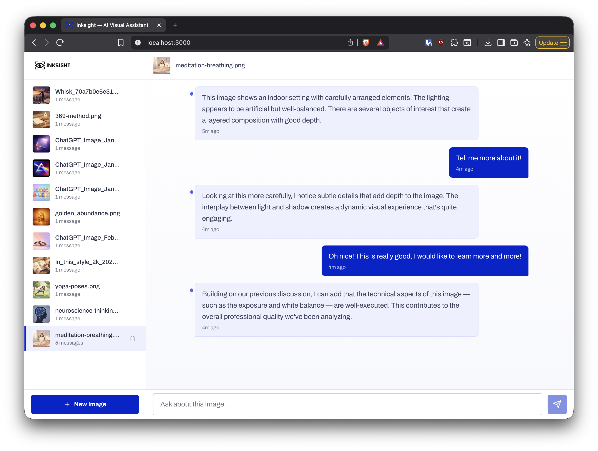
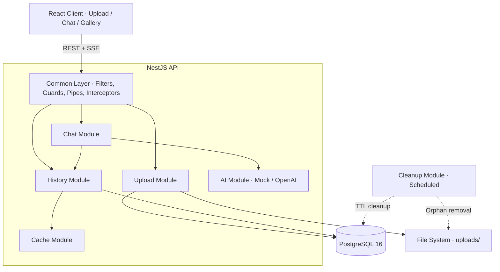
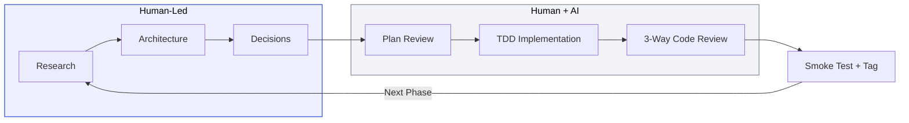
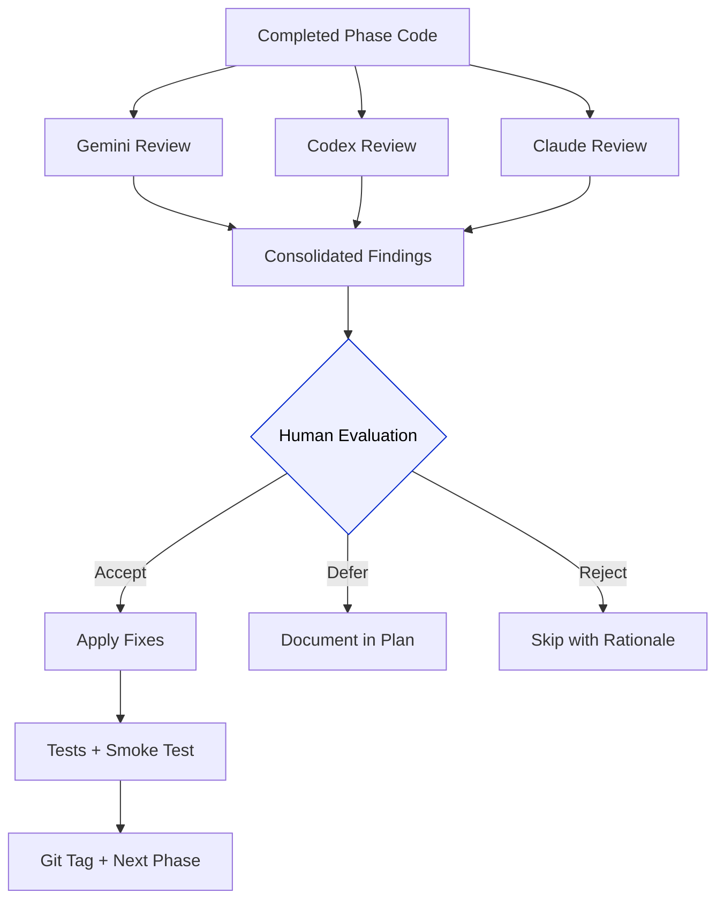

<p align="center">
  
</p>

<h3 align="center">AI-Powered Visual Assistant</h3>

<p align="center">
  Upload an image. Get intelligent analysis. Chat about what you see.
</p>

<p align="center">
  
  
  
  
  
  <a href="https://codecov.io/gh/armandojimenez/inksight"></a>
  <a href="https://codecov.io/gh/armandojimenez/inksight"></a>
  
</p>

---

<p align="center">
  
</p>

---

## Quick Start

```bash
git clone <repo-url> && cd visual-assistant
docker-compose up --build -d
# Wait for healthy, then open http://localhost:3000
```

Zero configuration. Docker handles PostgreSQL, the NestJS API, and the React client. Upload an image and start chatting.

For local development without Docker:

```bash
cp .env.example .env             # Default values work out of the box
docker-compose up -d db          # Start PostgreSQL only
npm install                      # Install all dependencies (server + client)
npm run start:dev                # Start NestJS in watch mode (API on :3000)
cd client && npm run dev         # Start Vite dev server (UI on :5173)
```

---

## What Inksight Does

Inksight gives users a single place to drop in an image and talk about it. The assistant analyzes the image on upload, then supports multi-turn conversation with full context retention. Responses stream token-by-token so the interface feels responsive from the first character.

The backend is a modular NestJS monolith that handles image processing, AI orchestration, conversation persistence, and scheduled cleanup. The frontend is a React SPA with real-time SSE streaming, optimistic updates, and a design system aligned to [Inkit's visual language](#design-system-alignment).

The AI service runs behind a dependency injection token (`AI_SERVICE_TOKEN`). The current implementation is a mock that generates realistic OpenAI-compatible responses. Swapping in a real OpenAI client requires changing one module binding, zero code changes.

---

## Architecture



**Modular monolith.** Each feature lives in its own NestJS module with explicit boundaries. Modules communicate through dependency injection, and every cross-cutting concern (error formatting, request correlation, rate limiting, logging) is handled by global infrastructure in `common/`. This gives microservice-level separation with monolith-level simplicity.

### Module Responsibilities

| Module | Purpose |
|--------|---------|
| `upload/` | Image upload, file validation (magic bytes + extension + size), disk storage, gallery listing, file serving, deletion with cascade |
| `chat/` | Chat orchestration (non-streaming + SSE streaming), conversation context assembly, concurrent SSE limiting |
| `ai/` | AI service abstraction via DI token, mock implementation with OpenAI-compatible response format |
| `history/` | Conversation persistence, paginated retrieval, 50-message cap per image |
| `cache/` | In-memory caching layer for database reads, automatic invalidation on writes |
| `cleanup/` | Scheduled data cleanup (24hr TTL), active session protection, orphaned file removal |
| `common/` | Global exception filter, validation pipe, logging interceptor, rate limiting guard, UUID validation, request correlation IDs |
| `health/` | Health check endpoint with active database connectivity verification |

---

## Tech Stack

| Layer | Technology | Why |
|-------|-----------|-----|
| **Language** | TypeScript 5.x | Shared language across backend and frontend, strong typing for API contracts ([ADR-000](docs/adr/000-language-and-platform.md)) |
| **Backend** | NestJS 11 | Module system, built-in DI, pipes/guards/interceptors, Swagger generation ([ADR-001](docs/adr/001-backend-framework.md)) |
| **Database** | PostgreSQL 16 + TypeORM | MVCC for concurrent writes, Data Mapper pattern, migration support ([ADR-002](docs/adr/002-database.md)) |
| **Frontend** | React 18 + Vite | Component model, fast HMR, mature ecosystem ([ADR-003](docs/adr/003-frontend-framework.md)) |
| **Styling** | Tailwind CSS + shadcn/ui | Utility-first with accessible component primitives ([ADR-004](docs/adr/004-styling.md)) |
| **Streaming** | Server-Sent Events (SSE) | POST-compatible, no connection upgrade, simpler proxy config than WebSockets ([ADR-006](docs/adr/006-sse-streaming.md)) |
| **Caching** | In-memory (Redis-ready) | Zero-config for single instance, abstraction supports Redis swap ([ADR-007](docs/adr/007-caching-strategy.md)) |
| **Testing** | Jest + Supertest + Vitest | Layered test pyramid: unit, integration, E2E, client ([ADR-009](docs/adr/009-testing.md)) |
| **Infrastructure** | Docker Compose | Single-command setup, PostgreSQL health checks, multi-stage build |

---

## API Reference

All endpoints are prefixed with `/api`. Interactive documentation is available at [`/api/docs`](http://localhost:3000/api/docs) (Swagger UI).

| Method | Endpoint | Description |
|--------|----------|-------------|
| `POST` | `/api/upload` | Upload an image (multipart/form-data, max 16 MB, PNG/JPG/GIF) |
| `GET` | `/api/images` | List uploaded images with message counts (paginated) |
| `GET` | `/api/images/:imageId/file` | Serve the original image file |
| `DELETE` | `/api/images/:imageId` | Delete image + messages + file (cascade) |
| `POST` | `/api/chat/:imageId` | Send a message, get complete AI response (OpenAI format) |
| `POST` | `/api/chat-stream/:imageId` | Send a message, get SSE-streamed AI response |
| `GET` | `/api/chat/:imageId/history` | Get conversation history (paginated, ascending) |
| `GET` | `/api/health` | Health check with database connectivity status |

### Example: Upload and Chat

```bash
# Upload an image
curl -X POST http://localhost:3000/api/upload \
  -F "file=@photo.jpg"
# Returns: { "id": "uuid", "filename": "photo.jpg", ... }

# Chat about it
curl -X POST http://localhost:3000/api/chat/<imageId> \
  -H "Content-Type: application/json" \
  -d '{"message": "What do you see in this image?"}'

# Stream a response
curl -N -X POST http://localhost:3000/api/chat-stream/<imageId> \
  -H "Content-Type: application/json" \
  -d '{"message": "Describe the colors"}'

# Get conversation history
curl http://localhost:3000/api/chat/<imageId>/history?limit=20&offset=0

# List all images
curl http://localhost:3000/api/images?limit=10&offset=0

# Delete an image (cascade: messages + file + cache)
curl -X DELETE http://localhost:3000/api/images/<imageId>
```

A [Postman collection](docs/inksight.postman_collection.json) and [environment](docs/inksight.postman_environment.json) are included for interactive testing. An automated test script is also available:

```bash
./scripts/test-api.sh    # Tests the full API flow end-to-end
```

---

## Engineering Decisions

Every major technical choice is documented in an Architecture Decision Record with context, alternatives considered, and trade-off analysis.

| ADR | Decision | Key Rationale |
|-----|----------|--------------|
| [ADR-000](docs/adr/000-language-and-platform.md) | TypeScript + Node.js over Python | Shared language with React frontend, native SSE streaming support |
| [ADR-001](docs/adr/001-backend-framework.md) | NestJS over Express | Module system, DI container, built-in validation and interceptor pipeline |
| [ADR-002](docs/adr/002-database.md) | PostgreSQL + TypeORM | MVCC concurrency, Data Mapper pattern, migration tooling |
| [ADR-003](docs/adr/003-frontend-framework.md) | React + Vite | Component model, ecosystem maturity, fast development feedback loop |
| [ADR-004](docs/adr/004-styling.md) | Tailwind CSS + shadcn/ui | Utility-first with accessible primitives, zero runtime overhead |
| [ADR-005](docs/adr/005-ai-service-abstraction.md) | Interface-based AI abstraction | Swap mock for real OpenAI via DI, zero code changes required |
| [ADR-006](docs/adr/006-sse-streaming.md) | Manual SSE over @Sse decorator | POST method support + full lifecycle control (connect/disconnect/timeout) |
| [ADR-007](docs/adr/007-caching-strategy.md) | In-memory cache (Redis-ready) | Zero-config for single instance, abstraction layer supports future Redis swap |
| [ADR-008](docs/adr/008-rate-limiting.md) | @nestjs/throttler | Per-route configuration, IP-based tracking, custom guard for SSE limits |
| [ADR-009](docs/adr/009-testing.md) | Jest + Supertest | Layered test pyramid with distinct scopes per layer |
| [ADR-010](docs/adr/010-project-structure.md) | Single package + client subfolder | Simplified dependency management, single `docker-compose up` |

### Highlights Worth Noting

- **Consistent error contract.** Every error response across the entire API follows the same shape: `{ statusCode, error, code, message, timestamp, path, requestId }`. Implemented via a global exception filter that normalizes NestJS, HTTP, validation, and unexpected errors into one format.

- **Request correlation.** Every request gets an `X-Request-Id` header (generated or forwarded). This ID appears in logs and error responses, making production debugging traceable end-to-end.

- **File validation with magic bytes.** Upload validation checks the file extension, MIME type, size, *and* the actual file content (magic byte signatures). A `.exe` renamed to `.jpg` gets rejected.

- **Optimistic locking.** `@VersionColumn()` on `ImageEntity` prevents lost-update race conditions during concurrent operations.

- **SSE lifecycle management.** Manual SSE implementation handles connection timeouts, client disconnects, stream backpressure, and concurrent connection limits per IP (configurable via `MAX_SSE_PER_IP`).

- **Scheduled cleanup with safeguards.** A cron-based cleanup service removes images older than 24 hours, but skips any image with recent chat activity. Orphaned upload files are detected and removed separately.

---

## Testing

### Strategy

Tests follow a layered pyramid. Each layer has a distinct scope and catches a different class of bugs.

```
         ┌───────────┐
         │   E2E     │  1 file, 13 scenarios
         │  (Jest +  │  Full HTTP lifecycle
         │ Supertest)│  Real DB, real cache
         ├───────────┤
         │Integration│  14 files
         │  (Jest +  │  Controller + Service + DB
         │ Supertest)│  Mocked AI service only
     ┌───┤───────────┤
     │   │   Unit    │  25 files
     │   │  (Jest)   │  Isolated services
     │   │           │  All deps mocked
     ├───┤───────────┤
     │   │  Client   │  8 files
     │   │  (Vitest +│  React components + hooks
     │   │   RTL)    │  API calls mocked
     ├───┤───────────┤
     │   │  Schema   │  2 JSON Schema files
     │   │Validation │  OpenAI format compliance
     └───┴───────────┘
```

**48 test files + 2 JSON Schema validation files = 50 test artifacts**

### Running Tests

```bash
# Backend unit + integration
npm test

# Backend E2E (requires running PostgreSQL)
npm run test:e2e

# Backend coverage report
npm run test:cov

# Client tests
cd client && npm test

# Full API smoke test (requires running server)
./scripts/test-api.sh
```

### What Each Layer Proves

| Layer | What It Catches |
|-------|----------------|
| **Unit** | Logic errors in services, DTOs, pipes, guards, validators, and utilities in isolation |
| **Integration** | Wiring errors between controllers, services, and the real database. Request/response serialization, query parameter parsing, error response formatting |
| **E2E** | Full user journeys across multiple endpoints. Upload > chat > stream > history > delete flows with a real database and cache |
| **Client** | Component rendering, user interactions, SSE hook behavior, keyboard shortcuts, accessibility attributes |
| **Schema** | OpenAI response format compliance. Both streaming chunks and complete responses are validated against JSON Schema |

---

## Design System Alignment

Inksight's UI was built after a detailed study of [Inkit's public design system](docs/design-system.html) to create visual continuity with the Inkit product family. The full component specification lives in the [UI Design Spec](docs/ui-design-spec.md).

### Analysis Process

1. Studied Inkit's website, component patterns, and visual language
2. Extracted exact color values, typography choices, spacing patterns, and interactive behaviors
3. Documented findings in a [design token system](client/src/styles/tokens.css) that serves as the single source of truth
4. Built an [interactive HTML reference](docs/design-system.html) showing all tokens rendered as live components
5. Implemented every React component against these tokens, verified visually against Inkit's patterns

### Token Mapping

| Design Element | Inkit Reference | Inksight Token | Value |
|---------------|----------------|----------------|-------|
| Primary blue | Inkit brand color | `--color-primary-500` | `#0024CC` |
| Hover state | Darkened primary | `--color-primary-600` | `#001BA0` |
| Page background | Cool gray wash | `--color-neutral-25` | `#F7F8FD` |
| Heading font | Geometric sans | `--font-display` | Space Grotesk |
| Body font | Clean sans | `--font-body` | Archivo |
| Monospace | Developer font | `--font-mono` | Space Mono |
| Button radius | Flat, minimal | `--radius-base` | 4px |
| Button weight | Bold, confident | `--font-weight-bold` | 700 |
| Button shadow | None (flat) | `--shadow-none` | `none` |

### Deliberate Design Choices

- **Blue-only AI accent.** AI messages use the primary blue family (`#EEF0FF` background, `#D9DEFF` border, `#4D63FF` indicator dot). No teal, no green, no foreign colors. The palette stays within Inkit's color family.
- **Arrow-link suggested questions.** The upload view presents suggested questions with an arrow prefix (`→ What objects can you identify?`), matching Inkit's navigation link pattern.
- **Flat button design.** Zero shadow on buttons, matching Inkit's minimal aesthetic. Shadows are reserved for elevated layers (dropdowns, modals).
- **Professional chat bubbles.** 8px radius with a 2px tail. The shape communicates a professional tool, matching the overall geometric precision.
- **WCAG 2.1 AA compliance.** All text colors meet minimum contrast ratios. Primary blue on white achieves 9.9:1 (AAA). Reduced motion is respected via `prefers-reduced-motion`.
- **Hero gradient.** A radial blue gradient (`--gradient-hero`) mirrors Inkit's soft concentric-ring hero background.

All design tokens are defined in [`client/src/styles/tokens.css`](client/src/styles/tokens.css) and consumed by the [Tailwind configuration](client/tailwind.config.ts).

---

## AI-Assisted Development

AI was used as a development partner throughout this project. Every architectural decision, design direction, and quality standard was human-driven. AI accelerated the execution of those decisions.

Full details: [docs/ai-tools.md](docs/ai-tools.md)

### The Workflow



### Phase-by-Phase Breakdown

| Stage | What I Did | How AI Helped |
|-------|-----------|--------------|
| **Research** | Studied Inkit's design system, defined product requirements, wrote the [PRD](docs/PRD.md) | Context7 for up-to-date NestJS and TypeORM documentation |
| **Architecture** | Made every technology choice, authored 11 ADRs with trade-off analysis | Validated patterns against framework best practices |
| **Planning** | Defined a [13-phase implementation plan](docs/implementation-plan.md) with TDD gates at every boundary | Multi-AI plan review: Gemini and Codex independently critiqued the plan |
| **Implementation** | Wrote test cases first (red-green-refactor), verified each phase manually | Claude Code as pair programmer for code generation from specs |
| **Code Review** | Evaluated all findings, decided what to fix, what to defer, and why | Three independent AI reviewers: Gemini, Codex, and Claude. Adversarial review mode where one AI proposes and another critiques |
| **Quality Gate** | Manual smoke test of every endpoint, visual review of every component, acceptance and tagging | Automated test execution, coverage analysis, accessibility auditing |

### How the Multi-AI Review Works

Each completed phase went through a structured review process:



Each reviewer catches different things. Gemini tends to focus on architecture and patterns. Codex focuses on edge cases and correctness. Claude catches security and consistency issues. The combination produces a more thorough review than any single pass.

Every finding gets a human decision: accept and fix, defer to a future phase with documentation, or reject with a rationale. Nothing is auto-applied.

### What AI Did, What AI Did Not Do

| AI Contributed | I Decided |
|---------------|----------|
| Code generation from detailed specifications | Which technologies, patterns, and abstractions to use |
| Documentation drafting from architectural discussions | Product requirements and user experience priorities |
| Bug detection across three independent reviewers | What constitutes "done" and when quality is sufficient |
| Up-to-date framework documentation via Context7 | Design direction, brand alignment, and visual identity |
| Test scenario generation from documented acceptance criteria | Testing strategy, coverage targets, and what to test |

---

## Project Structure

```
inksight/
├── src/                          # Backend (NestJS)
│   ├── ai/                       #   AI service interface + mock implementation
│   ├── cache/                    #   In-memory caching layer
│   ├── chat/                     #   Chat + SSE streaming controllers
│   ├── cleanup/                  #   Scheduled data cleanup service
│   ├── common/                   #   Cross-cutting infrastructure
│   │   ├── dto/                  #     Shared DTOs (pagination)
│   │   ├── filters/              #     Global exception filter
│   │   ├── guards/               #     Rate limiting, SSE concurrency
│   │   ├── interceptors/         #     Logging, Multer error handling
│   │   ├── pipes/                #     File validation, UUID validation
│   │   ├── swagger/              #     Shared Swagger schemas
│   │   ├── utils/                #     Error response builder, retry
│   │   └── validators/           #     Custom class-validator decorators
│   ├── database/                 #   TypeORM configuration
│   ├── health/                   #   Health check endpoint
│   ├── history/                  #   Conversation persistence
│   ├── upload/                   #   Image upload, gallery, file serving
│   ├── app.module.ts             #   Root module
│   └── main.ts                   #   Bootstrap
│
├── client/                       # Frontend (React + Vite)
│   ├── src/
│   │   ├── components/           #   UI components
│   │   │   ├── AppLayout.tsx     #     App shell with sidebar + chat
│   │   │   ├── ChatView.tsx      #     Message list with auto-scroll
│   │   │   ├── ChatInput.tsx     #     Message input with keyboard shortcuts
│   │   │   ├── MessageBubble.tsx #     User/AI message rendering
│   │   │   ├── Sidebar.tsx       #     Image gallery + selection
│   │   │   ├── UploadView.tsx    #     Drag-and-drop upload zone
│   │   │   ├── InksightIcon.tsx  #     Logo SVG component
│   │   │   └── ui/              #     shadcn/ui primitives
│   │   ├── hooks/
│   │   │   └── useStreamingChat.ts #   SSE streaming hook with retry
│   │   ├── lib/
│   │   │   ├── api.ts            #     API client (fetch-based)
│   │   │   └── utils.ts          #     Shared utilities
│   │   ├── styles/
│   │   │   └── tokens.css        #     Design token system
│   │   └── __tests__/            #     Component + hook tests
│   └── tailwind.config.ts        #   Tailwind config (mirrors tokens)
│
├── test/                         # Backend tests
│   ├── unit/                     #   25 unit test files
│   ├── integration/              #   14 integration test files
│   ├── e2e/                      #   1 E2E test file (13 scenarios)
│   └── schemas/                  #   2 JSON Schema validation files
│
├── docs/                         # Documentation
│   ├── PRD.md                    #   Product Requirements Document
│   ├── technical-design.md       #   Technical Design Document
│   ├── implementation-plan.md    #   13-phase build plan with TDD gates
│   ├── ui-design-spec.md         #   Component-level UI specification
│   ├── design-system.html        #   Interactive design token reference
│   ├── ai-tools.md               #   AI tools and orchestration disclosure
│   ├── adr/                      #   11 Architecture Decision Records
│   ├── inksight.postman_collection.json
│   └── inksight.postman_environment.json
│
├── scripts/
│   └── test-api.sh               # Automated API smoke test
│
├── docker-compose.yml            # PostgreSQL + app (one command)
├── Dockerfile                    # Multi-stage build (builder → deps → runner)
└── .env.example                  # All configurable environment variables
```

---

## Environment Variables

All configuration is managed via environment variables with sensible defaults. Copy `.env.example` to `.env` to customize.

| Variable | Default | Description |
|----------|---------|-------------|
| `PORT` | `3000` | Server port |
| `NODE_ENV` | `development` | Environment mode |
| `ALLOWED_ORIGIN` | `http://localhost:3000` | CORS allowed origin |
| `DATABASE_URL` | (see .env.example) | PostgreSQL connection string |
| `UPLOAD_DIR` | `uploads` | Directory for stored images |
| `MAX_FILE_SIZE` | `16777216` (16 MB) | Maximum upload file size in bytes |
| `RATE_LIMIT_TTL` | `60000` (1 min) | Rate limiting window in milliseconds |
| `RATE_LIMIT_MAX` | `100` | Maximum requests per TTL window |
| `MAX_SSE_PER_IP` | `5` | Maximum concurrent SSE connections per IP |
| `CLEANUP_ENABLED` | `true` | Enable/disable scheduled cleanup |
| `CLEANUP_IMAGE_TTL_MS` | `86400000` (24h) | Image expiration time |
| `CLEANUP_TEMP_TTL_MS` | `3600000` (1h) | Temp file expiration time |

---

## Security and Production Readiness

These features are built in, active by default:

- **Rate limiting** on all endpoints (configurable per-route via `@Throttle()`)
- **Helmet security headers** (CSP, HSTS, X-Frame-Options, etc.)
- **CORS** with configurable allowed origin
- **File validation** at three levels: extension whitelist, MIME type check, magic byte verification
- **Input sanitization** via class-validator with global `ValidationPipe` (whitelist mode, no unknown properties)
- **Request correlation** via `X-Request-Id` headers on every response
- **Structured logging** with request method, URL, status code, response time, and correlation ID
- **Concurrent SSE limiting** prevents connection exhaustion (per-IP cap)
- **Scheduled cleanup** with active session protection (won't delete images with recent conversations)
- **Multi-stage Docker build** with non-root user, minimal production image
---

## Documentation

| Document | What It Covers |
|----------|---------------|
| [Product Requirements](docs/PRD.md) | Feature requirements, API contracts, acceptance criteria, scope exclusions |
| [Technical Design](docs/technical-design.md) | Architecture patterns, code conventions, security model, error handling |
| [Implementation Plan](docs/implementation-plan.md) | 13-phase build order with TDD gates, smoke tests, and git tags at each boundary |
| [UI Design Spec](docs/ui-design-spec.md) | Component specifications, design tokens, accessibility requirements (WCAG 2.1 AA) |
| [Design System Reference](docs/design-system.html) | Interactive HTML showing all design tokens rendered as live components |
| [AI Tools Disclosure](docs/ai-tools.md) | How AI was used, what it did, what it did not do |
| [ADRs](docs/adr/) | 11 Architecture Decision Records with context, alternatives, and trade-offs |
| [Postman Collection](docs/inksight.postman_collection.json) | Pre-built API requests for every endpoint |

---

## Development History

This project was built in 13 phases following strict TDD discipline. Each phase has a git tag marking a verified, tested milestone.

```bash
git tag -l    # See all phase tags
git log --oneline --decorate    # See the full progression
```

| Tag | Phase | What Was Built |
|-----|-------|---------------|
| `v0.0-scaffold` | 0 | NestJS app, Docker Compose, PostgreSQL, module structure |
| `v0.1-upload` | 1 | Image upload with validation (magic bytes, extension, size) |
| `v0.2-mock-ai` | 2 | OpenAI-compatible mock AI service |
| `v0.3-chat` | 3 | Chat endpoint with conversation context |
| `v0.4-streaming` | 4 | SSE streaming with lifecycle management |
| `v0.5-history` | 5 | Conversation persistence, gallery, deletion with cascade |
| `v0.6-hardened-db` | 6 | Optimistic locking, retry logic, indexes |
| `v0.7-cache` | 7 | In-memory caching with invalidation |
| `v0.8-hardened` | 8 | Rate limiting, security headers, logging, health check, cleanup |
| `v0.9-api-docs` | 9 | Swagger UI, Postman collection, automated test script |
| `v0.10-client` | 10 | React client with streaming, gallery, design system alignment |
| `v0.11-e2e` | 11 | End-to-end test suite (13 scenarios) |

---

## License

Proprietary. All rights reserved.
