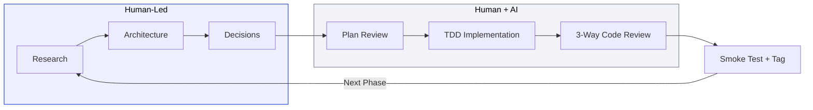
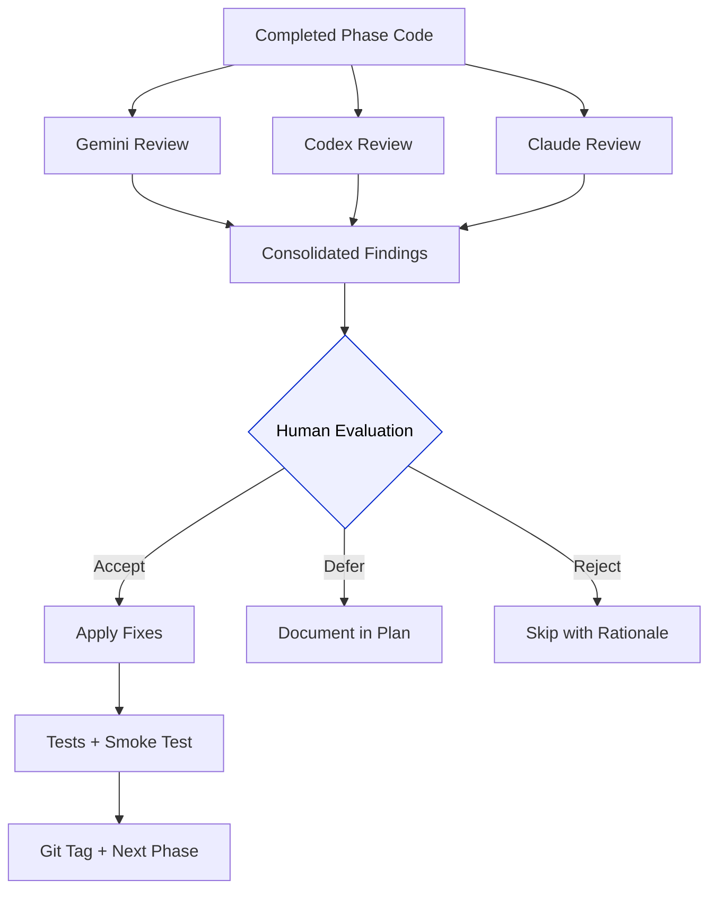

# AI Tools & Orchestration

**Author:** Inksight Team
**Date:** March 2, 2026

---

## Philosophy

AI was used as a **force multiplier** for implementation, not a replacement for engineering judgment. Every architectural decision, design choice, and trade-off was made by me. AI tools accelerated the execution of those decisions.

The approach: **I do the thinking, AI does the typing.**

---

## Tools Used

### Claude Code (Primary Development Tool)

**Role:** AI pair programmer for the entire development lifecycle

**How it was used:**
- **Architecture Design:** Explored trade-offs between frameworks, databases, and patterns through structured Q&A. All decisions documented in ADRs.
- **Implementation:** Generated code from detailed specifications (PRD, Technical Design Doc). Every module was reviewed, tested, and refined before committing.
- **Testing:** Generated test suites from documented test scenarios, then iterated on edge cases.
- **Documentation:** Assisted with PRD, Technical Design Document, and ADR generation from architectural discussions.

### Claude Code Skills Used

| Skill | Purpose | Where Applied |
|-------|---------|--------------|
| **Frontend Design** | UI/UX design system creation, visual prototyping | Design spec, React component architecture, interactive prototype |
| **Code Review** | Quality assurance, security analysis | Pre-commit review of all modules |
| **Security Audit** | OWASP compliance, vulnerability detection | Upload validation, rate limiting, input sanitization |
| **Test Automation** | Test strategy, coverage analysis | Unit, integration, and E2E test suites |

### Web Research

- Reviewed Inkit's public website to study brand design system (colors, typography, visual patterns)
- Referenced OpenAI API documentation for exact response format compliance
- Consulted NestJS, TypeORM, and React documentation for best practices

---

## Development Workflow

### Phase-by-Phase Breakdown

| Stage | What I Did | How AI Helped |
|-------|-----------|--------------|
| **Research** | Studied Inkit's design system, defined product requirements, wrote the [PRD](PRD.md) | Context7 for up-to-date NestJS and TypeORM documentation |
| **Architecture** | Made every technology choice, authored 11 ADRs with trade-off analysis | Validated patterns against framework best practices |
| **Planning** | Defined a [13-phase implementation plan](implementation-plan.md) with TDD gates at every boundary | Multi-AI plan review: Gemini and Codex independently critiqued the plan |
| **Implementation** | Wrote test cases first (red-green-refactor), verified each phase manually | Claude Code as pair programmer for code generation from specs |
| **Code Review** | Evaluated all findings, decided what to fix, what to defer, and why | Three independent AI reviewers: Gemini, Codex, and Claude. Adversarial review mode where one AI proposes and another critiques |
| **Quality Gate** | Manual smoke test of every endpoint, visual review of every component, acceptance and tagging | Automated test execution, coverage analysis, accessibility auditing |

---

## Multi-AI Review Process

Each completed phase went through a structured review:

Each reviewer catches different things. Gemini tends to focus on architecture and patterns. Codex focuses on edge cases and correctness. Claude catches security and consistency issues. The combination produces a more thorough review than any single pass.

Every finding gets a human decision: accept and fix, defer to a future phase with documentation, or reject with a rationale. Nothing is auto-applied.

---

## What AI Did, What AI Did Not Do

| AI Contributed | I Decided |
|---------------|----------|
| Code generation from detailed specifications | Which technologies, patterns, and abstractions to use |
| Documentation drafting from architectural discussions | Product requirements and user experience priorities |
| Bug detection across three independent reviewers | What constitutes "done" and when quality is sufficient |
| Up-to-date framework documentation via Context7 | Design direction, brand alignment, and visual identity |
| Test scenario generation from documented acceptance criteria | Testing strategy, coverage targets, and what to test |
